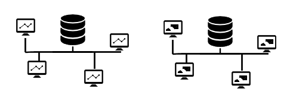

# Application architectures with persistent storage
*Author: Kasper B. Graversen*
<ArticleHeaderUrls/>
<Categories Tags="Architecture, Design, Database, Monolith, Micro_Service">
</Categories>

*Through time as hardware got faster and cheaper, the role of databases in application architecture vastly changed - from many applications sharing the same database, to having a single application using many databases. Let's have a look at the various architectures.*

Please show your support by sharing and voting:

<SocialShareButtons>
</SocialShareButtons>

Table of Content

   * [1. Table sharing: One database for different applications](#table-sharing-one-database-for-different-applications)
   * [2. Multitenancy: One database for multiple application instances](#multitenancy-one-database-for-multiple-application-instances)
   * [3. One databases for one application instance](#one-databases-for-one-application-instance)
   * [4. OLTP-OLAP segregation: Two databases for one application instance](#oltp-olap-segregation-two-databases-for-one-application-instance)
   * [5. Multiple databases for one application instance](#multiple-databases-for-one-application-instance)
   * [6. Summary](#summary)

With the rise of the micro service architecture in particular, we see a new way of organizing data storage of an application. From ancient time (1960s) till today we see vastly different perspectives on what constitutes proper database design. Not surprisingly, the technical evolution of the hardware databases are running on impacts how we use them. But just as importantly, the growing dependence on tooling and the maturity of those, raises the bar for increasingly looser coupling.

 
 

  
## 1. Table sharing: One database for different applications 

This is the idea that you have *one* database available for all your applications. The applications not only share the same database, they may share the tables as well. You'll see this architectural style in use in the oldest of applications - typically mainframe applications. In the banking and stock market industry even today you'll see this application in full use. While the whole idea sounds a bit crazy, remind yourself, that there are still many applications out there plugged together in this style. And moving away from mainframes has proved difficult. Performance and transactional safety is unparallel measured in hardware performance. Simple, fast and transactional inter-application communication. No need for a messaging infrastructure such as messaging-components or file-ftp'ing onto shared drives.

But there are severe consistency concerns. Any change can have unpredictable consequences. Since any program may write any data to any table, a careless implementation in one application may render the data unusable to other applications - perhaps even making them crash. A change requires the understanding of the invariants of each application and the change must be classified as being a breaking or non-breaking change. In the case of breaking changes *multiple applications* need be upgraded and released in a *big bang* fashion.

**Advantages**

  * Cheap licencing - there is only one server.
  * Hardware well utilized as it serves multiple applications.
  * Automatically consistent state across applications.
  * Backup and restore is simple - there is only one database.

   
**Disadvantages**

  * Stability issues, when an application issues heavy queries other applications may suffer to the extent that they become unresponsive.
  * Unavailability issues, restarting the database server, perhaps due to some upgrade, all applications experience down time simultaneously.
  * Security concerns, any program may access any data - also data that does not belong to it.
  * Making changes to the data model is very hard since it requires potentially *a whole suite* of applications to be changed.
  * Consistency issues, when an application changes how it stores data, may damage other applications.

Required tooling and tooling maturity index: Low

## 2. Multitenancy: One database for multiple application instances

This is the idea that you keep several instances of an application on the same database. For example, administrative systems licensed and hosted for different clients. The means by which you distinguish rows belonging to one client from the rows of another client is by adding  a column to each database table with the identity of the owner. For example the column `OwnerId` or `ClientId`. Notice that the architecture style presented in *(1)* can easily be combined with this architectural style.

Many of the concerns raised in *(1)*, of course, also apply to this architecture. But there are differences to the advantages of this approach. I guess the reason why this architecture arises in system after system, is that it solves concrete problems. The event where a software vendor goes from one to two clients, with little to no automation, suddenly he finds himself seriously lacking automation. And typically, the first few clients are small with little cash in their pockets. So a solution has to be found that is fast and affordable. I believe this is why this pattern is so common... Busy software shops buy time with this architecture: All the infrastructure for propagating database changes, keeping several databases structurally in sync is solved. When the software changes due to features or bug fixing, it is easy to propagate the changes to all clients - after all there is only one database!

With the rapid advancement of cloud hosting and PaaS, the term [multi tenant architecture](https://en.wikipedia.org/wiki/Multitenancy) has been re-branded as more intelligent ways of sharing resources and keeping licensing costs down. It is different in the sense that tenants are isolated from each other and the resource are shared fairly between tenants. In this article we are talking about the low-level implementation at the table level. 

**Advantages**

  * Cheap hardware and licencing - there is only one server. Especially for cloud hosting.
  * Good utilization of hardware as clients are sharing the server.
  * Making changes is easy. Changes are rolled out to all clients automatically.
  * Backup and restore is simple - there is only one database.

**Disadvantages**

  * Stability issues, when one client is under heavy load pressure, other clients suffer.
  * Security concerns, a bug causes the program to operate on data from several clients, which can be disastrous. Imagine trying to ship (and bill the poor bugger) order #2023 from *across* vastly different clients to a customer. Suddenly the customer is billed for a vacuum cleaner and a sailing boat, in addition to the deodorant he ordered.
  * Incremental roll out is much more difficult. Typically, you cannot roll out changes first to the smaller clients and ensure things are working o.k. before rolling out the bigger clients - typically it is all or nothing.
  * Slight overhead as each row in the database holds and extra id, additionally, each index too will hold this extra information.
  * Higher storage requirements as data may be duplicated in different applications.

Required tooling maturity: 1

## 3. One databases for one application instance

This is the idea that each application instance should own its own database. This is the natural approach form most modern software development (when they don't choose architecture *(5)*). For a single application instance there is no overhead of this architecture, whereas more structured work flows are required when the number of application instances grow. As noted above, time pressure may throw a project spiraling down into the architecture described in *(2)*.

Interestingly, the advantages and disadvantages in *(1)* and *(2)* have now all switched places in this architecture.
​​

**Advantages**

  * Allows incremental roll out of new schema definitions and code releases
  * Stability: Heavy queries of one application instance does not affect other application instances
  * Security: Data for one client is not accessible to other clients
  * No overhead of a `clientId` or similar superfluous columns.

   
**Disadvantages**

  * More expensive hardware and licencing - a server for each application instance.
  * Rolling out changes requires automation as the number of application instances grow.
  * Backup and restore is a bit more involved as several databases need to be operated on.
  * Higher storage requirements as data may be duplicated in different applications.

Required tooling maturity: 3

## 4. OLTP-OLAP segregation: Two databases for one application instance

This is the idea that the database is split in two in recognition, that there are two distinct usages of the database. An *OLTP* (On-line Transaction Processing) database which is characterized by a large volume short lived transactions. Primary concern is fast query processing. An *OLAP* (On-line Analytical Processing, AKA Data Warehouse) database which is characterized by low volume of transactions, often long-running and complex. Typically these transactions deal with BI or Data mining like historic data and producing key business-performance indicators.

Data is organized differently in the two systems to cater for the very different nature of the queries performed in the two systems. Hence OLTP-databases typically organize data star schemas (multi-dimensional schemas) that allows for easy aggregation across business entities.

​​
**Advantages**

  * Structure: Data may be structured to cater for two distinct kinds of query needs
  * Performance: Heavy OLAP-queries do not affect the responsiveness of the OLTP

   
**Disadvantages**

  * More expensive hardware and licencing - a server for each database
  * Rolling out changes in the OLTP may require changes in the OLAP
  * Backup and restore is a bit more involved as several databases need to be operated on.

Required tooling maturity: 5

## 5. Multiple databases for one application instance

This is the idea that a single application instance is using *several* databases for storing its state. The databases may [mix and match different technologies](http://www.martinfowler.com/bliki/PolyglotPersistence.html) (e.g. SQL and NoSQL) that best fit the problem domain. The choice of database technology hinges on whether your business data is more in alignment with say a graph than a relation database. For example, you centralize all logging in ElasticSearch and all your performance metrics in InfluxDb. These services are tailored for these exact use scenarios. And similarly, other parts of your application may choose to store its data in a database of its own. Yes, we are now entering the land of micro services. And while not explicitly shown in the depiction, this architecture can easily encompass one or more OLAP databases thrown into the mix.​

Contrasting this architecture to the architecture of (1) this architecture seems almost perverted - the sheer resources required for servers and inter-service communication is staggering.​​ Not to mention, it is quite common for micro services to store state from other parts of the system in their own database in order to reduce the number of requests to other services. Hence the storage requirements rise. A service may choose to listen to one or more kinds of events, and it may update its state about other parts of the system through said events' payload. 

An important side note to this architecture is a considered need for infrastructure. With loose coupling you need a communication mechanism. With the many independent processes on many machines, a simple logging of program state requires tools such as a shared storage for logging messages as it quickly becomes impractical to log on to several machines. 

​​
**Advantages**

  * Allows incremental roll out of new schema definitions and code releases
  * Stability: Heavy queries in one part of the system do not affect other parts of the application.
  * Understandability: A bounded context per database significantly neatly confines the data-space of the application part.
  * Enable structuring and storing data in a fashion to cater for the use scenarios of the domain.
  * Performance: Heavy queries in one part of the application does not affect other parts of the application.

   
**Disadvantages**

  * Loss of transactional consistency. Only the weaker "eventual consistency" can be guaranteed.
  * Bigger storage requirements as data often is duplicated in many parts of the application instance.
  * A need for a traffic-heavy communication infrastructure such as a message busy.
  * More expensive hardware and licencing - more servers are involved.
  * Rolling out changes requires automation as the number of databases grow.
  * Backup and restore is more involved as several databases need be operated on.

Required tooling maturity: 10    

## 6. Summary

With the different architectural styles we observe a fan of approaches. The more you entangle your applications, the more opportunities there are for reaping resource benefits and light-weight transactional safety. Partly that is the reason it has shown surprisingly difficult to re-write old mainframe in modern programming languages using modern architectures whilst maintaining performance. On the other hand, changes become increasingly difficult to carry out, to the point where your applications are in a choke-hold. 

At the other end of the spectrum, emphasis is put on isolating business in bounded contexts. Isolation enables independent upgrade and roll-out of new features, and easier extension of the system. The cost is sacrificing the ACID properties across business entities, more data duplication, and a growing need for infrastructure. I

Please show your support by sharing and voting:
<SocialShareButtons>
</SocialShareButtons>

​​

  
<CommentText>
</CommentText>

  
