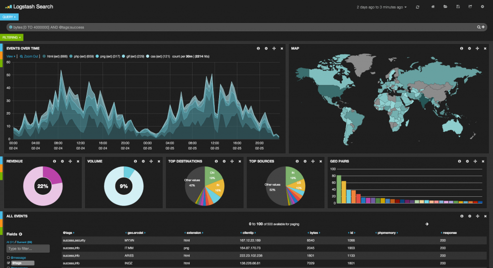

draft
# Discovering metrics by letting go of anxieties and just Log everything
*Author: Kasper B. Graversen*
<ArticleHeaderUrls/><Categories Tags="Software_Development">
</Categories>

*This article touches upon possibly one of the most boring topics in computer science. Logging. But logging can quickly become quite interesting when you log to a search engine rather than a flag file. By embracing a strategy of logging everything, and using the right tool chain, we empower both the business, the Q&A and the developers to identify correlations and count events vital to the business.*

Please show your support by sharing and voting: 
<SocialShareButtons>
</SocialShareButtons> 

Table of Content

   * [1. The problem with diagnostics](#the-problem-with-diagnostics)
   * [2. Let go of your anxieties](#let-go-of-your-anxieties)
   * [3. What to log... everything](#what-to-log-everything)
   * [4. An open world to explore](#an-open-world-to-explore)
   * [5. Eyeballs required](#eyeballs-required)
   * [6. Disk space requirements](#disk-space-requirements)
   * [7. Dogfooding](#dogfooding)

   

## 1. The problem with diagnostics

Imagine the clock is saying 18:15 hours, you promised the wife to be home hours ago. You are facing massive problems in production. What do you do? Turn to the log files. What server do we start on, after all you have two handfuls to go through. What will you be looking for? Diminishing disk space, a hardware failure, or is it the application itself. When was the last release done and what is the current user load. As you can see there are many questions to be answered, and providing answers is time consuming. Sure you can build bespoke monitoring tools texting you when disk space is low. But as you can see from my above "shopping list" - being able to predict and tool for error scenarios is difficult. At least if you want to cover every single one of them.

Now there are equally interesting questions to be answered in situations where sh*t is not hitting the fan. What parts of our system is the slowest and giving users a bad experience, and under which conditions? What parts of our public API are never used and which we thus may stop supporting? Are sales suddenly dropping (maybe due to a newly introduced bug).
   
Wouldn't it be cool if you could quickly engineer a control board like the one above (taken from www.elastic.co). In fact you can very easily using ElasticSearch and Kibana - both open source tools. 

But how? By letting go of your anxieties.
   

   
## 2. Let go of your anxieties 

A nature of experienced programmers is to worry. Worry about speed and storage requirements. That is why many had a hard transitioning  from assembly programming (or some language close to the metal), to the garbage collected languages. Of course one difficulty was the getting used to the different way of organizing code. But part of the transitioning problem was worrying about the expensive cost of objects instantiation and garbage collection was part of the transition problems. Today you still see people being worried about these matters and making noise about it. Most, however, have stops worrying about this, and understand that with the ever faster computers, vast majority of applications  do not suffer from garbage collection overhead. 

Having embraced modern garbage collection languages, you may still have fears of the cost of storage, CPU and network speed. With this in mind, we have to let go and think differently. It is *not* too expensive to log everything. We *can* send all data over the wire. By congregating all the data in one central data base (which of course is distributed in nature in terms of processing and storing data), we can create visualizations that may help us monitor of our system. Visualizations are no harder to create than using a regular search engine - provided we use the right tools. And the more information we log, the more interesting questions can we answer and the more correlations we can discover.

A tool suite I am most familiar with is storing data in ElasticSearch, and querying data using Kibana. With this we have seriously easy tooling at our hands. Tools so powerful your boss may chip in creating his own views on the system.

## 3. What to log... everything

We need to log everything.  The more we log the bigger a world open before out eyes.

* Log all requests to the site. log all internal service calls. Log all calls to upstream service. And while we are at it, log all requests to the database. When we log calls to services, and to the data base, we may record and log the *wall time* of said requests.
* But don't stop here. Also log important changes happen in your product. Log when you do new releases.
* But don't stop here. Log DevOps metrics such as free disk space, CPU load, but also infra structural changes like when you add or change hardware.
* But don't stop here. Log when important changes happen in the business. When a new add campaign is launched, the release of a product line and so on. Or 
* Log key business events such as the selling of a service or product, its price and the profits.

It seems like a lot of data. Likely it is. But let go of your anxieties.. at least for the moment.

## 4. An open world to explore

What we have now, is a pretty good picture of the world. 

* We can see which parts of our API is used, and which hasn't been called in years. It sounds odd, but if you have many consumers of your API's, figuring out what part of the system never gets used is a real problem. 
* We can aggregate API calls with response times, finding out, what are the expensive queries and focus on optimizing those.
* We can see how our API is used. Clients may throw together their application in great haste, leading to sub-optimal use of the API, or not take advantage of the latest additions. We can thus advice a different use making the client's application swifter - along with reducing the resources spent on our cluster. 
* We can find the most frequent and most expensive database interactions - and correlate it with usage of our API usage
* We can correlate sale with new releases. A sudden drop in sales is a smoking gun pointing at the recent deployment.

Most of these are techie queries. But recall, we are also logging business events. We can thus also query

* The correlation of sales with campaigns. Are the campaigns worth their cost in added sales?
* Are we receiving more sales when the servers got upgraded and the end users got a more responsive site?

But wait! There's more.

When you apply the same logging strategy to test environments, you may provide a nice platform for Q&A to introspect the system at it's lower levels without having them turn to SQL.

## 5. Eyeballs required

There are costs associated with logging. There is the one time costs associated with setting up the infrastructure and code the logging calls. 

More importantly, however, is the running cost. Eyeballs are required to look at the graphs. How often this is needed is very contextual. But getting an idea about what a healthy system looks like is well advised. Often it is insufficient to look at only one days worth of data. Many business have cycles, where traffic spike around the first in the month, and at the end of fiscal years. However uncomfortable those spikes are, they are part of the life of you application.

Presenting the vast opportunities to the business in terms of what they may extract from the data may leave their hands hanging above their head for days in sheer joy. But when everyday hits again, finding the time to look at the data, may be harder than expected. *Wanting* the ability to do something is very different from actually *doing* that thing.

So do logging in steps, gradually log more and more, and evaluate who is benefiting - and actually looking at the graphs. 

## 6. Disk space requirements

Data require disk space, but there are a number of strategies we can employ to reduce the costs.

* Older data may be moved to slower disks in the cluster (slower queries, but cheaper storage)
* Some data older than x months may be purged or aggregated, for example api calls may be gropued and counted in time series spanning a month.

Think twice about what data to purge. You may not know today what questions you'd like to answer tomorrow. Data may provide key insights tomorrow that will be forever lost when you press the delete button! 

## 7. Dogfooding

Dogfooding is a slang term in reference the situation where a company or person uses its own product to test and promote the it. So are we logging everything where I work? No - but we are on the way. 

We *are* logging API calls. We *have* identified suboptimal API interactions from customers. We are using logging to help Q&A. And recently, I augmented our logging with performance metrics (elapsed milliseconds). Looking forward to seeing trend both now and over time!

But we also have had to reduce other parts of what we are logging. Notably some of the business related stuff. Since we logged Kibana usage, we have identified that certain part of the business is never looking at the data.

On a final note, it is important to remember, that just because two or three dimensions of data is correlated, it does *not* mean that there is a causality. A very humour proof of this highlighted by the site www showing great examples of related data that never could be causal.

Please show your support by sharing and voting: <SocialShareButtons>

</SocialShareButtons> 

  
<CommentText>
</CommentText>

  