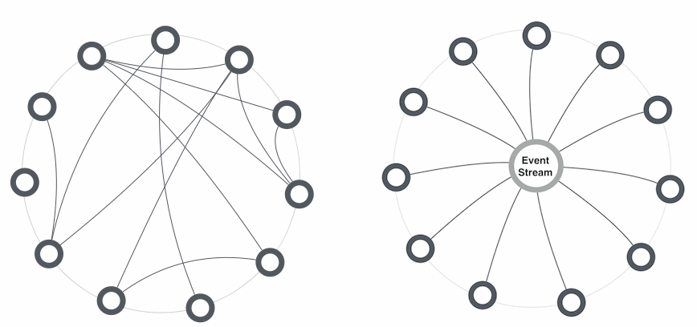

draft
# Naming micro service events

When architecting a system consisting of micro services, an important aspect is the naming of micro service events. Perhaps this should come as no surprise, given that naming of methods and classes is understood to be one of the most difficult tasks of programming. Naming micro service events is different to naming methods and classes, and in the can prove a challenge to get right. 

Table of Content

   * [1. Background: Micro service interactions](#background-micro-service-interactions)
   * [2. Event naming principles](#event-naming-principles)
   * [3. Prefer events rather than commands](#prefer-events-rather-than-commands)
     * [3.1 Turning commands into events](#turning-commands-into-events)
   * [4. Use past tense](#use-past-tense)
     * [4.1 Present perfect, past perfect, and past tense](#present-perfect-past-perfect-and-past-tense)
   * [5. Natural naming](#natural-naming)
     * [5.1 Use high level descriptions from the business domain](#use-high-level-descriptions-from-the-business-domain)
     * [5.2 The event must reflect reality](#the-event-must-reflect-reality)
     * [5.3 Consistent casing and word separation](#consistent-casing-and-word-separation)
   * [7. object_action naming](#object_action-naming)
   * [6. Context vs. event](#context-vs-event)
     * [2.x Context in the payload or several events](#x-context-in-the-payload-or-several-events)
   * [3. Technical event naming](#technical-event-naming)
   * [4. Conclusions](#conclusions)
   
   
   

## 1. Background: Micro service interactions

To better understand how to correctly name micro service events, it is important to understand the interaction between micro services. Roughly speaking, we can organize service interactions either by means of *orchestration* or by *choreography* (terminology from "Building Micro services", Sam Newman). You can think of *choreography* as services directly calling other services (possibly by means of service discovery). *Orchestration* can be understood as a loosely coupled "publish-subscribe pattern" where a service publishes that some event has occurred, other services may then choose to listen. 

The choreography approach is familiar grounds to many, as it is comparable to objects calling methods on other objects. However, with this approach you'll soon find yourself in a tangled web of service dependencies as your micro service architecture grows. It almost looks like the mess we were trying to escape from. This is exemplified in

 
 
*(images from https://www.thoughtworks.com/insights/blog/scaling-microservices-event-stream)*

The main motivation to switching to a micro service architecture, is to reduce tangling and clutter, hence almost by definition, we should try to minimize direct service interaction (*choreography*). 

The main point: We address complexity of (most) service interaction by means of listening to events. 

## 2. Event naming principles

Having understood how services cooperate, we know that events are central. As with most programming, *naming* is one of the more difficult aspects.
 
I have attempted to assemble the principles that lay foundation to how we go about naming micro service events. The end goal is to stir a debate and making all of us smarter in the process. 

Unsurprisingly, the principles are contractive. However, a more relevant question is whether the principles are exhaustive. Your feedback may well improve in this area.

## 3. Prefer events rather than commands

When naming events, we can name them either as a *command* or as an *event*. A command, which is called "an imperative" in the English grammar - expressing that something has to be done. Examples are "CloseAccount" and "DeleteUser". An event, on the other hand, expresses that something has happened.

Given our understanding of micro service cooperation in the background section, it is  obvious why we prefer the events naming style over the command.

### 3.1 Turning commands into events

Commands arise naturally for one of the following three reasons

  1. A human user interacted with the application.
  2. An integration point was triggered by another machine (e.g. when exposing an API).
  3. Time passes

It may not always be easy to turn commands into events. If your phone subscription payments are overdue, a dunning service will notice and slowly make your life miserable. You'll receive dunning letters, and eventually you may no longer make calls with your phone. Later, if that doesn't work, your phone will become fully blocked. 

Assume we want to implement the first phone blocking behaviour. Clearly we are dealing with a command (as time has passed and no payments were acknowledged). The command naming would suggest `BlockPhoneForIngoingCalls`. But we don't like that. Then maybe  `RequestedPhoneNumberIngoingBlock`. This, however, is just a command in disguise. Events beginning with `Request` or `Must` are clearly commands. 

Rather than focusing on the action to be taken, we should focus on what has happened. This makes it more natural for more services to subscribe to the same event. Perhaps we want a service to send a text message informing the subscriber of the blocking action. The situation is, that a subscriber has crossed some limit for acceptable overdue payments. Thus we get may use the more general name `LimitCrossedForBlockOfIncommingCalls`

A "mirror" event is required if the subscriber manages to pay his debts. A `LimitCrossedForUnBlockOfIncommingCalls` event perhaps. English is not my native language, so I may be going out on limb here, but to me there is something odd here. I tend to think of a limit as a one-way crossing. Thus, perhaps the word threshold is better than limit. 

This give us `ThresholdCrossedForBlockOfIncommingCalls` and `ThresholdCrossedForUnBlockOfIncommingCalls`.

## 4. Use past tense

Naming events in micro services is very different than naming events in Gui programming such as WPF or Javascript. In these settings, typically your event will be of a present tense such as `onclick` or `onkeydown`. In fact many, if not the majority, of the standard Javascript DOM events start with `on`.

In the world of micro services, events are not raised and handled in the same manner.   "Traditionally" a program execution cannot continue before all event handlers have executed, for micro services, it is the opposite. You fire an event, forget about it, and go on your way. 

Thus both conceptually, and the fact that we are transporting event messages through a medium, pertain in the notion of a delay. When a service is reacting to an event, will be a reaction to something that has already happened. *For that reason, it is preferred that a past tense is used*.

### 4.1 Present perfect, past perfect, and past tense

If you want to geek out, you can pull out your grammar book and find that the English language grammatically, has no less than three different categories of past tenses. Coincidently, so does the Danish language. You may find it a source of inspiration, the *past tense* grammar rule is the most relevant. On the other hand, maybe you can formulate rules excluding wording in the eg. present perfect category.

The three categories are

* **Past perfect** describes that something has happened before something else that has also happened in the past.
* **present perfect** describes something that started in the past and continues in the present.
* **past tense** describes something that happened in the past.
 

 
 
## 5. Natural naming

### 5.1 Use high level descriptions from the business domain

Focus on naming events which describe something meaningful has happened in the domain. While it may easily be translated into software, the real value is that it can be quickly grasped by non technical people. 

The motivation is to bond a closer relationship between the business and the application. It also support the facilitation of [Event storming practices](http://ziobrando.blogspot.dk/2013/11/introducing-event-storming.html)

 *(image from http://www.slideshare.net/ziobrando/event-storming-recipes)*

In this spirit, you should also try to exclude the sender of the event in the event name. Any receiver should be oblivious to whom had published the event in the first place.

With time, you may find it increasingly difficult to name all events such that non-technical people can understand them. This is only natural. Do not get alarmed, but try to create order within the realm of those events (more on this later).

### 5.2 The event must reflect reality

When having focus on expressing your events in the past tense, you some times fall into the trap of naming the event something that has not yet happened. For example, a mobile can be rendered useless if the owner reports it stolen - a so-called theft-block feature. To implement this, you could publish say a `PhoneNumberBlockedInNetwork` event from your web application, triggering a network gateway service to to block the phone.

`PhoneNumberBlockedInNetwork` is better than say `BlockPhoneInNetwork` since we are using a past tense. There are still problems, however. At the time we publish the event `PhoneNumberBlockedInNetwork`, the phone is actually *not* blocked. It can be really confusing especially in a larger network of services, if you pr. event case have to know whether it is something we want to happen or if it has happened.

A better name may be `PhoneReportedStolen`. This name suggest we need to block the phone, while at the same time is so general the business can understand it, and possibly other services can gain value from subscribing to it too.

### 5.3 Consistent casing and word separation 

When using a longer event name consisting of several words, programmers may turn to the formatting rules of the programming language used for implementing the service. For example the event "phone reported stolen" could be formatted either as `phoneReportedStolen` (Java style), `PhoneReportedStolen` (C# style) or `phone_report_stolen` (C style). Particularly, when implementing events in different languages, you may quickly find your event names in a mess of mixed uppercasing and lowercasing, sprinkled with camel casing and underscores .

Another problem is that the names look awfully programming-like. Recall, that one of the ideas of micro services is to bring closer the code and the business. A way to alienate the business from the code is to use code-like naming.

A nice naming scheme inspired by Lisp is to use all lowercase words separated by hyphens. Lisp is not a coincidental choice. More than most language designs, it is oriented toward the linguistic tradition: *"The Lisp community regards metalinguistic abstraction as a standard programming technique"* [page 7]( http://dspace.mit.edu/bitstream/handle/1721.1/6064/AIM-986.pdf). 

With this naming scheme we get the event `phone-reported-stolen`. 

I like the naming scheme for a number of reasons:

* In many languages (say English), the hyphen is used for creating compound words (like  mass-produced).   
* For that reason it looks much more natural than the computer language inspired schemes. 
* The hyphen has a duality to it. It separates words, while simultaneously making the words appear as a whole. 

## 7. object_action naming

When the number of events grow in your system	

Her er nogle eksempler fra vores system:

business-user-updated
product-review-reported
product-review-report-closed
customer-activated
product-review-archived
product-review-deleted

Så man kan kalde det en slags "after-the-fact-CRUD" for noget af det, og andet er lidt bredt, såsom "business-user-updated", som jo kan dække over mange ting. Så det holder sig meget til objekter, men det er objekter i forretningssproget, så jeg synes det holder.

"context" har jeg faktisk ikke eksempler på, så det var nok bare en tanke. Derimod har vi "object-detail-action", såsom "businessunit-trustscore-updated", hvor en business unit bliver opdateret, men specifikt dens trustscore.

  
## 6. Context vs. event 

### 2.x Context in the payload or several events
* Det kan ske at det samme event skal behandles forskelligt alt efter feks hvem der afsender - men så må der være tilstand på hændelen som afgør det. I dette tilfælde, prøv at lade denne tilstand være en beskrivelse af en forretningmæssig kontekst fremfor i kode termer. Dvs. istedet for en "int priority" kunne man have en kontekst { bruger, vip-bruger, sagsbehandler, chef } der kan være med til at hjælpe modtageren med at reagere forskelligt på den samme type af events.

 
 > Det kan ske at det samme event skal behandles forskelligt alt efter feks hvem der afsender

Dette er forskellige events i min bog. Hvis du begynder at differentiere på afsender, er der et problem med design/arkitektur synes jeg. Hvis du f.eks. har en "priority", som du nævner, så har du lavet en dependency da alle services skal kende til hinandens forståelse af prioritet.

  
## 3. Technical event naming   
  
Commands
========
Nogle events er commands--- tekniske event, der er ikke en forretningsmæssig baggrund for at noget skal ske. 
Der er et behov for at man skal gøre noget.. 

Typisk navngives i nutid, evt. med et Foranstillet "Must" eller "Request".

En anden ting jeg kom til at tænke på, hvilken form for payload har de events I bruger? Jeg synes det er svært at finde ud af hvor meget payload der skal være...
- Skal det kun være ID'er?
- Skal der være "før" og "efter" objekter?
- Hvis man laver meget data på dem, hvordan versionerer man så sine events?

## 4. Conclusions

* 
Finding good names require fiddling with words, perhaps more than when you name methods and classes when programming.

