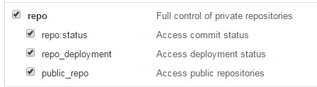

# `PullOrCloneAll` - cloning  and updating Git repositories through the GitHub Api
*Author: Kasper B. Graversen*
<ArticleHeaderUrls/>
<Categories Tags="Git, GitHub, Powershell">
</Categories>


*When the number of your GitHub repositories grow beyond a handful, you need to automate a workflow for keeping them all in sync. 
In this article we show how to easily clone and pull all your GitHub repositories.*


Please show your support by sharing and voting:

<SocialShareButtons>
</SocialShareButtons>


Table of Content

   * [1. Introduction](#introduction)
   * [2. Setup access to private repositories](#setup-access-to-private-repositories)
   * [3. The script](#the-script)
   * [4. Dealing with submodules](#dealing-with-submodules)

	 
## 1. Introduction

We want to automate the cloning and pulling of GitHub repositories. This is particularly welcomming when the number of repositories grow beyond a handful. Rather than maintaining a list of repositories in a text file manually, we can utilize the GitHub Api and fetch the list of repos.

The flow of the script works as follows

  * Fetch the list of repositories from Github
  * For each repository
    * If no local folder is found of the repository 
	 * Create folder and clone
    * If local folder is found
	 * Ensure we are in a situation where we can fetch
	 * `git pull`

A complication in using the Github api is that the result is paginated. If you have more than 100 repositories (which is my current situation) - we have to fetch all pages one before we have full list of repositories.
	 
For my current work situation, all work is done on feature branches - hence I know that a repository is on the `master` branch, the coast is clear for pulling new change sets. Am I on a feature branch, I don't want to be disturbed by potential merge conflicts. 

It is tempt to support pulling while having local changes and/or not be on `master`. For example by the stashing the local changes, switch to `master`, pull, and then return to the working branch and pop the stash. I've been reluctant to taking this step mostly due to error situations where the flow is stopped halfway through. What is the state of the repo if  the network connection suddenly drops, how do I detect the various errors? If my repo is in a semi-bad state, do we need to pop the stash? etc. 

Maybe it's straight forward, but I'm no powershell wizard - *improvement suggestions are welcommed.*


## 2. Setup access to private repositories

In order to run the script, you must first create a *Personal access token*. You need to have special rights if you have private repositories. I've found it sufficient to provide the "repo" rights as shown below.



Of course storing the api key inside your script is a security concern. So if you have the time I suggest using a credentials manager.


## 3. The script 

```
$git="C:\Program Files\Git\bin\git.exe"
$gitHubApiKey = "babe165ebef6025ae9e5e2..."

function PullOrCloneAll($path="c:\src")
{
	cd $path
	
	$repositories = FetchRepoList
	
	$i = 0
	Foreach($repo IN $repositories)
	{ 
		$i += 1
		Write-Host("{0,3} {1,-40} {2,-40}" -f ` $i, $repo.Name, $repo.Clone_Url)
		
		if(test-path $repo.Name)
		{
			Pull($repo);
		}
		else
		{
			Clone($repo);
		}		
	}
}
```


```
function FetchRepoList()
{
	$uri = "https://api.github.com:443/orgs/MYNAMEORORGANIZATION/repos?page=&per_page=100&access_token="+$gitHubApiKey
	
	$all = @()
	$page = 0
	
	$any = $TRUE
	while($any)
	{
		$any = $FALSE

		$page += 1		
		$urin = $uri.replace("?page=","?page="+$page)

		$repositories = (Invoke-RestMethod -Uri $urin) 

		Foreach($repo IN $repositories)
		{
			$all += $repo
			$any = $TRUE
		}
	}
	
	Write-Host("Found " + $All.Count + " repositories")
	
	return $all | Sort-Object -property Name
}


function MayPullFromRepo()
{
	$status = & $git status --porcelain
	if($status.Length -gt 0)
	{
		Write-Host -ForegroundColor red "!! LOCAL CHANGES - giving up"
    	Write-Host("'"+$status+"'" + $status.Length)
		return $FALSE
	}
	
	$branch = & $git rev-parse --abbrev-ref HEAD
	if($branch -ne "master")
	{
		Write-Host -ForegroundColor red "!! NOT ON MASTER - giving up"		
		return $FALSE
	}
	
	return $TRUE
}


function Pull($repo)
{	
	cd $repo.Name
	
	if(MayPullFromRepo)
	{
		$pullresult = & $git pull --ff-only --no-stat
		if($pullresult -ne "Already up-to-date.")
		{
			Write-Host -ForegroundColor green "" + $pullresult
		}
	}
	
	cd $path
}

function Clone($repo)
{
	Write-Host("Clonning...");
	& $git clone -v --recurse-submodules --progress $repo.Clone_Url $repo.Name # alternatively replace "Clone_Url" with "ssh_url" 
}
```

Notice that I've inlined my personal access token directly in the script. While this is not best practice, it is sufficiently simple to show what I wanted to show here. 

I'd very much like hear your opinion and improvement ideas.


## 4. Dealing with submodules 
You may experience that submodules are not properly fetched. It may help to use an SSH key and using the `ssh_url` property rather than `Clone_Url` inside function `CLone()`


Please show your support by sharing and voting:
<SocialShareButtons>
</SocialShareButtons>


<br><br>
<CommentText>
</CommentText>

<br><br>
