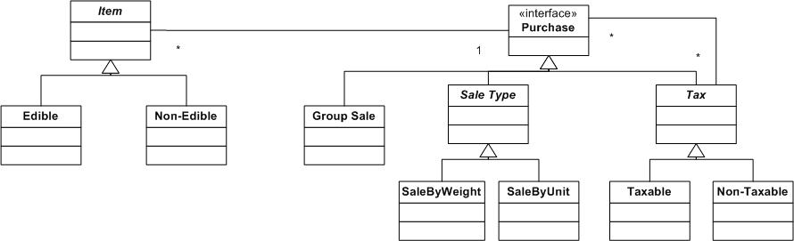

# Optimal indent size for code readability
*Author: Kasper B. Graversen*
<br>[[Introduction]](https://github.com/kbilsted/CodeQualityAndReadability/blob/master/README.md) [[All categories]](https://github.com/kbilsted/CodeQualityAndReadability/blob/master/AllTags.md) [[All articles]](https://github.com/kbilsted/CodeQualityAndReadability/blob/master/AllArticles.md)
<br>
<Categories Tags="Code_Layout, Code_Readability, Design_Pattern">
[](https://github.com/kbilsted/CodeQualityAndReadability/blob/master/Tags/Code_Layout.md)
[](https://github.com/kbilsted/CodeQualityAndReadability/blob/master/Tags/Code_Readability.md)
[](https://github.com/kbilsted/CodeQualityAndReadability/blob/master/Tags/Design_Pattern.md)
</Categories>

*In this article, we investigate the effects on source code, when using small or large indentation size. Small idention sizes seems to have a negative effect on code readability. Larger ones, the opposite.*

Please show your support by sharing and voting:
<SocialShareButtons>
[](https://www.reddit.com/submit?url=https://github.com/kbilsted/CodeQualityAndReadability/blob/master/Articles/Readability/OptimalIndentSizeForCodeReadability.md&title=Optimal%20indent%20size%20for%20code%20readability)
[](https://twitter.com/intent/tweet?url=https://github.com/kbilsted/CodeQualityAndReadability/blob/master/Articles/Readability/OptimalIndentSizeForCodeReadability.md&text=Optimal%20indent%20size%20for%20code%20readability&via=kbilsted)
[](https://plus.google.com/share?url=https://github.com/kbilsted/CodeQualityAndReadability/blob/master/Articles/Readability/OptimalIndentSizeForCodeReadability.md)
[](https://facebook.com/sharer.php?u=https://github.com/kbilsted/CodeQualityAndReadability/blob/master/Articles/Readability/OptimalIndentSizeForCodeReadability.md&t=Optimal%20indent%20size%20for%20code%20readability)
[](http://www.linkedin.com/shareArticle?mini=true&url=https://github.com/kbilsted/CodeQualityAndReadability/blob/master/Articles/Readability/OptimalIndentSizeForCodeReadability.md)
[](http://cloud.feedly.com/#subscription%2Ffeed%2Fhttps://github.com/kbilsted/CodeQualityAndReadability/blob/master/Articles/Readability/OptimalIndentSizeForCodeReadability.md)
[](http://news.ycombinator.com/submitlink?u=https://github.com/kbilsted/CodeQualityAndReadability/blob/master/Articles/Readability/OptimalIndentSizeForCodeReadability.md&t=Optimal%20indent%20size%20for%20code%20readability)
</SocialShareButtons>


Table of Content
   * [1. Introduction](#1-introduction)
   * [2. Background information](#2-background-information)
     * [2.1 Code consistency](#21-code-consistency)
     * [2.2 Indention-based languages](#22-indention-based-languages)
     * [2.3 Research](#23-research)
     * [2.4 Tabs or spaces](#24-tabs-or-spaces)
     * [2.5 The linux kernel coding guidelines](#25-the-linux-kernel-coding-guidelines)
   * [3. Investigating the primary effect](#3-investigating-the-primary-effect)
     * [3.1 Indent size: 0](#31-indent-size-0)
     * [3.2 Indent size: 18](#32-indent-size-18)
     * [3.3 Indent size: 4](#33-indent-size-4)
   * [4. Recommendations](#4-recommendations)
     * [4.1 Recommendation: Use 4 space indent](#41-recommendation-use-4-space-indent)
     * [4.2. Recommendation: A single statement pr. line](#42-recommendation-a-single-statement-pr-line)
   * [5. The secondary effect of code indention](#5-the-secondary-effect-of-code-indention)
     * [5.1 Technique: Quick bailout](#51-technique-quick-bailout)
     * [5.2 Technique: Early return / Fail fast](#52-technique-early-return--fail-fast)
     * [5.3 Technique: Separate iteration from processing](#53-technique-separate-iteration-from-processing)
     * [5.4 Design patterns](#54-design-patterns)
       * [5.4.1 The strategy design pattern](#541-the-strategy-design-pattern)
       * [5.4.2 The decorator design pattern](#542-the-decorator-design-pattern)
     * [5.5 Summary](#55-summary)
   * [6. Conclusions](#6-conclusions)
   * [7. Comments and corrections](#7-comments-and-corrections)

   
## 1. Introduction

The indent size you use has two significant effects on your source code. A **primary effect** is immediately evident - the ease with which you quickly scan down through code. A **secondary effect**, and perhaps the most important, an effect which subtly shape how the source code  is structured. 

Like the gravitational force, we tend to forget its existence and focus solely on the immediately observable. Ultimately, choosing an indent size for your project is, therefore, about conscientiously selecting properties of the source code you find desirable. 


## 2. Background information

One of the great debates on code formatting, is what indent size to use. You will find different advice and a lot of options and very little fact. The advice I've come across mentions indent size of either 2, 3, 4, or 8. So which is the superior? And why are no one recommending 1, 5, 6 or 18 as the indent size?


### 2.1 Code consistency

While most cannot agree on a fixed number, most can agree to consistency being of significant importance. Prefer a project-wide style over individual preference. Consistency within a project is important. Consistency within one module or package is most important.


### 2.2 Indention-based languages
What about indention-based languages? Since they use indention to demarcate scope as opposed to `{ }`,  their best practices carry weight. The following table shows the official coding guideline recommended indent size for each language:

| Language | Indent size | Tabs allowed |
|--------- | ----------- | ------------ | 
| [Python](https://www.python.org/dev/peps/pep-0008/) | 4 | (Yes) |
| [Ruby](https://github.com/styleguide/ruby)| 2 | Yes |
| [F#](https://msdn.microsoft.com/en-us/library/dd233191.aspx) | 3-4 | No |

Evidently, they cannot agree on anything either.


### 2.3 Research
Little research has been carried out in terms of readability and indent size. The only I've come across carried out in "recent times" is 
 [*"Program Indentation and Comprehensibility"* by Miaria et. al, Communications of the ACM 26, (Nov. 1983) p.861-867](https://www.cs.umd.edu/~ben/papers/Miara1983Program.pdf)

They investigate novice programmers (2 years) reading a Pascal program. They found 2, 4 spaces to be optimal and that there there is no measurable difference between the two. 6 is measurably worse and code without indentation is measurably awful. You probably could have guessed that.

Are these results the final truth? I doubt it. Ultimately, research in this area, measure with great bias the disposition of the subject more than anything else.


### 2.4 Tabs or spaces
No one seem to be able to agree on this either. It seems that tabs are becomming less popular, e.g. forbidden in F# and tolerated in Python 3 (Python 2 didn't mind tabs).  Nowadays most people seem to agree, that tabs causes too many problems with inconsistent formatting when sharing code between developers. 

Historically, tabs have played an important since they significantly reduced the source code size, and possibly were more convenient in a time where there was no IDE to continually format your code.

Others prefer tabs over spaces, since then the indentation on the screen is configurable to each programmer without disturbing colleagues preferences.  In practice, many have mixed experiences with this.

Also some put great emphasis on the semantic differences between tabs and spaces. They believe that tabs carry the meaning "indent one level", whereas a space carries the meaning of fine-tuning some visual layout.


### 2.5 The linux kernel coding guidelines

Possibly the greatest source of inspiration for my thinking on indent size is the [Linux kernel coding style](https://www.kernel.org/doc/Documentation/CodingStyle). Excuse my long quote, I have not been able to reduce it further without loss of meaning:

> ... indentations 8 characters. There are heretic movements that try to make indentations 4 (or even 2!) characters deep, and that is akin to trying to define the value of PI to be 3.
>
> Rationale: The whole idea behind indentation is to clearly define where a block of control starts and ends.  Especially when you've been looking at your screen for 20 straight hours...
>
> Now, some people will claim that having 8-character indentations makes the code move too far to the right, and makes it hard to read on a 80-character terminal screen ... if you need more than 3 levels of indentation, you're screwed anyway, and should fix your program.


## 3. Investigating the primary effect

To better understand the rationale for using indent size *x*, let us experiment first with extreme values, then hone in on a tolerable value. We continually reformat the same code snippet using different indention sizes. This experiment serves to reveal the *primary effect* indention size has on our source code.


### 3.1 Indent size: 0

```C#
void Test()
{
int x = 23;
for (i=0; i<=5; i++)
{
if (i*i == x)
{
continue;
}
DoSomething();
}
}
```

Rating: *Bad*. With too little indention the structure of the code diminishes. You can't tell where anything begins or ends.


### 3.2 Indent size: 18

```C#
void Test() {
                  int x = 23;
                  for (i = 0; i <= 6; i++) {
                                  if (i*i == x) {
                                                  continue;
                                  }
                                  DoSomething();
                  }
}
```

Rating: *Bad*. Loads of indentation is obviously bad too. It becomes very difficult to visually link code to its parent   code block (method, branch, or loop). Your peripheral vision doesn't extend that far. Your eyes have to flick too far back and forth to facilitate reading, effectively making you loose track of where you are reading vertically, when the eyes move horizontally.


### 3.3 Indent size: 4

```C#
void Test() {
    int x = 23;
    for (i = 0; i <= 6; i++) {
        if (i*i == x) {
            continue;
        }
        DoSomething();
    }
}
```

Rating: *Good*. Here we see a nice trade-of between indention to clearly demarcate a new scope, while at the same time keeping things within the peripheral vision. I can't miss the start of a new block of code if I'm quickly scanning while things are not crammed together either. 


## 4. Recommendations

### 4.1 Recommendation: Use 4 space indent

My recommendation: **Use 4 space indention for modern OOP languages**. Now, why on earth do I prefer an indent size of 4 when having just wholeheartedly given my blessing to the Linux style guide line advocating indention of 8? 

I has to do with the programming language. Linux is programmed in C, my recommendation targets languages like C<sup>#</sup> and Java. In those languages, you have a significant "horizontal overhead" of having to wrap methods inside a name space *and* a class. That is not the case for C. Let us compare a "hello world" program in the two languages.

**C:** (indent size = 8)
```C
main()
{
________printf("Hello World");
}
```

<br>
  
**C<sup>#</sup>:** (indent size = 8)

```C#
namespace com.indentsize.example
{
         class Greeter
         {
                 public static void Main(string[] args)
                 {
__________________________Console.WriteLine("Hello World");
                 }
         }
}
```

For the C program, the code starts at column **8**, while for the C# program, code starts at column **24**. With 80-character limit pr. line you are spending *30%* of your screen real estate on blanks. That is insane.

The indent size of 4 is a good trade of between making it "hurt" to indent, and giving enough space to enable easily scanning down the code. If you need more than around three levels of indention - you are most probably going to regret it if you don't fix your code immediately. 

Ok, so if 4 is better than 8, why not use an indent size of 2?

**C<sup>#</sup>:** (indent size = 2)

```C#
namespace com.indentsize.example
{
  class Greeter
  {
    public static void Main(string[] args)
    {
______Console.WriteLine("Hello World");
    }
  }
}
```

With smaller indention sizes, you don't have that "horizontal pain" when making a new scope. This subtly encourage the developer to just indent another level. It may be so subtle that the developer doesn't even notice. And the code may look fine and nicely within the boundaries of the monitor standing a meter away from the screen. 

Typically, we don't like over-nested methods - they tend to grow in complexity. Section 4 addresses mechanisms to employ when using larger indention sizes.

Probably the only time I would ever use an indention of 2 is when doing power point slides. But that is a different environment. Here you cannot scroll, and moving from one slide to another effectively wipes everything from the first slide. Hence you typically feel the need to cramp as much code as possible onto each slide in order to give overview and tell a coherent story while pointing to various elements on the screen.


### 4.2. Recommendation: A single statement pr. line
Another way of making it hard to scan down code is to have two statements on one line. This is often done when the "if" and the "then" part takes up less space than the max. line length. Like the Linux coding guideline says: *"Don't put multiple statements on a single line unless you have something to hide"**. That is, **avoid** coding style like

```C#
if (a > 10 && b > 5) doSomethingA();
if (c < 5 || c+3+b == 6) doSomeB();
```

In effect we are dealing with an indention size of 1. And as pr. our previous recommendation to use indent size of 4, we are breaking that rule.
 
The code is much easier to scan if it looks like
 
```C#
if (a > 10 && b > 5) 
    doSomethingA();
    
if (c < 5 || c+3+b == 6) 
    doSomeB();
```
 
If you find you have to in-line the "then-part" of your "if" in order to save vertical space (for example to fit your method to the screen's real estate), you are likely to get more readability from extracting part(s) of that method into separate method(s) instead.
 
 


## 5. The secondary effect of code indention
Interestingly, the indent size has an indirect affect on how code is structured. It is rather subtle until you realize it. Then it becomes abundantly clear. Unfortunately. The secondary effect is  rarely brought up when the subject of indention size is discussed. 

**The secondary effect:** *With greater indention size, you have to structurally change your code in order to stay within reasonable line widths*. 

So how do we reduce the number of scopes in a method? After all, business logic may dictate the need for a lot of branching. We dedicate the rest of this section to showing some of the techniques people use. The list is by no means exhaustive. Have I forgotten a vital pattern, please let me know or make edits to this document accordingly.

A mutual trait between these techniques are that they make the code readable, they tend to break up the code into smaller units, some of which may easier be extracted into separate methods.

Notice, that many of these techniques goes against the principle of "Single Entry, Single Exit" essentially stating to only  use one return pr. method. But that principle is only relevant to languages with manual memory allocation. I find it useless in modern languages with automatic resource management and garbage collection. We simply do not need to worry about this stuff anymore. That is why we have patterns such as `Disposable`, `finally`-blocks, destructors, soft references and garbage collection.


### 5.1 Technique: Quick bailout

This technique is about substituting if-branching with `continue` in loops.

```C#
for (int i = 0; i < 5; i++)
{
    if(IsOfInterest(i))
    {
        DoStuff(i);
    }
} 
```

becomes

```C#
for (int i = 0; i < 5; i++)
{
    if(!IsOfInterest(i))
        continue;
        
    DoStuff(i);
} 
```


### 5.2 Technique: Early return / Fail fast

This technique is about substituting if-branching with `return` in method bodies. Typically this is happening at the beginning of the method body. Sometimes this technique is also referred to as ["fail fast"](http://martinfowler.com/ieeeSoftware/failFast.pdf).

```C#
void DoThing()
{
    if(user.HasAccess("Print"))
    {
        if(DateTime.Now.Hours > 12)
        {
            connection = PrinterConnection.Connect();
            if(connection != null)
            {
                print("message");
            }
        }
    }
}
```

becomes

```C#
private void PrintMessage()
{
    if(!user.HasAccess("Print"))
        return;
    if(DateTime.Now.Hours <= 12)
        return;
		    
    connection = PrinterConnection.Connect();
    if(connection == null)
        return;
 
    print("message");
}
```

I find the second easier to read, modify, maintain and debug.


### 5.3 Technique: Separate iteration from processing

In an effort to generally reduce nesting and method body length, the body of looping constructs are separated into a method.  This technique is often advocated by "uncle Bob".


```C#
void ProcessElements(Person[] elements)
{
    int accumulated = 0;
    foreach(var element in elements)
    {
        var tmp = element.Age + DateTime.Now.Year;
        accumulated += tmp / 2;
        Print(element);
    }
}    
```

```C#
void ProcessElements(Person[] elements)
{
    int accumulated = 0;
    foreach(var element in elements)
    {
        accumulated += ProcessElement(element);
    }
}

int ProcessElement(Person p)
{
    var tmp = element.Age + DateTime.Now.Year;
    Print(element);
    return tmp / 2;
}
```

I found this technique to take a little getting used to. But it actually makes a lot of sense. once you have it in your fingers. What we are doing is to separate the logic for the iteration with that of processing. 

For traditional looping using a variable such as the `for(int i = 0, ...)`, the benefits are even greater.

```C#
    for (int i = 0; i < elements.Length; i++)
    {
        var tmp = elements[i].Age + DateTime.Now.Year;
        ...
        i++ ??
    }
```

The longer the loop-body becomes, the more you have to scan, and worry whether the value of  `i` is changed somewhere in that loop. What seems to be a straight forward iteration of the `Elements` array may in fact not be a such.  By extracting out the processing, `i`is only changed in the iteration-logic and hence, it becomes clear that we are in fact just traversing.


### 5.4 Design patterns

There are many design patterns to help change the structure of your code. I can not go through them all here. The selected patterns are selected just to wet your appetite and to inspire you to at least evaluate whether some of your code could benefit from restructuring.

Generally, there are many benefits to using design patterns (and pitfalls!), but to describe these is outside the scope of this article.


#### 5.4.1 The strategy design pattern
When you identify having the same if-else structure in multiple methods, perhaps a price calculation based on the type of user or his memberships, you can separate the content of each if or else-block into a separate strategy. Effectively you are defining a family of algorithms, encapsulating each one, and making them
interchangeable to the client.



 Rather than trawling through endless if-else statements, you have separate strategy implementations, from which you select one - or you are given one by the caller, and then simply invoking it.


#### 5.4.2 The decorator design pattern
The decorator design pattern is another pattern that enable you to separate your logic into smaller interchangeable bits. Different to the strategy pattern, decorators are meant to be added to some base structure and enhance it. Eg. a decorator for implementing `3ItemsFor2` which you could combine with a `PayWithUserCredits` decorator. As shown in the UML for the strategy pattern, strategies are typically not combined.

See also [Malleable code by using decorators](https://github.com/kbilsted/CodeQualityAndReadability/blob/master/Articles/Design/MalleableCodeUsingDecorators.md) describing some of the additional benefits to be reaped from using this pattern.


### 5.5 Summary

The techniques shown all reduces indentation of code. Additionally, they have the following very nice properties concerning code readability in general:

* More but smaller methods
* Less convoluted code
* Easier to debug


 
## 6. Conclusions
 
I cannot tell you what indent size is the right one for you. You should pick the one that moves the code in the direction you desire. We have presented the fundamental properties of code indentation and shown:

> Larger indention reduces the number of scopes in a method,  
> while smaller indention sizes encourages more scopes within a method.

We recommend using an indentation size of 4 for modern OOP languages, but feel free to make up your own mind.


Further reading

* [Seven Pillars of Pretty Code](http://www.perforce.com/resources/white-papers/seven-pillars-pretty-code) is a short article on seven easy to follow rules for code readability.


Please show your support by sharing and voting:
<SocialShareButtons>
[](https://www.reddit.com/submit?url=https://github.com/kbilsted/CodeQualityAndReadability/blob/master/Articles/Readability/OptimalIndentSizeForCodeReadability.md&title=Optimal%20indent%20size%20for%20code%20readability)
[](https://twitter.com/intent/tweet?url=https://github.com/kbilsted/CodeQualityAndReadability/blob/master/Articles/Readability/OptimalIndentSizeForCodeReadability.md&text=Optimal%20indent%20size%20for%20code%20readability&via=kbilsted)
[](https://plus.google.com/share?url=https://github.com/kbilsted/CodeQualityAndReadability/blob/master/Articles/Readability/OptimalIndentSizeForCodeReadability.md)
[](https://facebook.com/sharer.php?u=https://github.com/kbilsted/CodeQualityAndReadability/blob/master/Articles/Readability/OptimalIndentSizeForCodeReadability.md&t=Optimal%20indent%20size%20for%20code%20readability)
[](http://www.linkedin.com/shareArticle?mini=true&url=https://github.com/kbilsted/CodeQualityAndReadability/blob/master/Articles/Readability/OptimalIndentSizeForCodeReadability.md)
[](http://cloud.feedly.com/#subscription%2Ffeed%2Fhttps://github.com/kbilsted/CodeQualityAndReadability/blob/master/Articles/Readability/OptimalIndentSizeForCodeReadability.md)
[](http://news.ycombinator.com/submitlink?u=https://github.com/kbilsted/CodeQualityAndReadability/blob/master/Articles/Readability/OptimalIndentSizeForCodeReadability.md&t=Optimal%20indent%20size%20for%20code%20readability)
</SocialShareButtons>


## 7. Comments and corrections

**Comments, corrections and other editorial changes are very welcome. Just log onto Github, press the edit button and fire away.**

*Comments should go below this line (and use the following template).*

Name: Bubba Jones
> text.. 
> text..


<br>
<br>
<br>


Read the [Introduction](https://github.com/kbilsted/CodeQualityAndReadability/blob/master/README.md) or browse the rest [of the site](https://github.com/kbilsted/CodeQualityAndReadability/blob/master/AllArticles.md)
<br>
[](https://github.com/igrigorik/ga-beacon)
