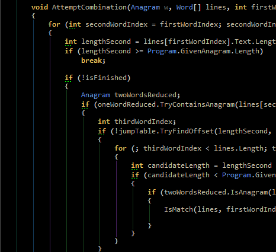
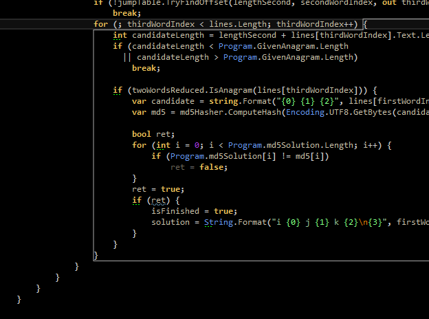
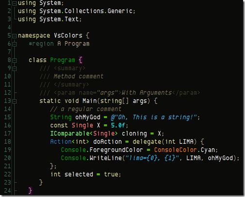

# Productivity features that may ruin code readability 
*Author: Kasper B. Graversen*
 [[Introduction]](http://kbilsted.github.io/CodeQualityAndReadability/) [[All categories]](http://kbilsted.github.io/CodeQualityAndReadability/AllTags.html) [[All articles]](http://kbilsted.github.io/CodeQualityAndReadability/AllArticles.html)
 
<Categories Tags="Code_Readability, Tools">
</Categories>

*It is the programmers that builds software, not the tools. Are glossy so-called productivity boosters beneficial or leading to sub-optimal code?*

Please show your support by sharing and voting:
<SocialShareButtons>
</SocialShareButtons>

Table of Content

   * [1. Introduction](#introduction)
   * [2. Folding](#folding)
     * [2.1 Code folding](#code-folding)
     * [2.2 Region folding](#region-folding)
   * [3. Outlining](#outlining)
     * [3.1 Code scrollbar](#code-scrollbar)
     * [3.2 Vertical indentation guides](#vertical-indentation-guides)
     * [3.3 Scope outlining](#scope-outlining)
   * [4. Syntax highlighting](#syntax-highlighting)
   * [5. Conclusions](#conclusions)
   * [6. Quotes...](#quotes)
   
   
   
   
## 1. Introduction

The other day I was reading the book "Object thinking", while [I have my reservations about some of its content](http://kbilsted.github.io/CodeQualityAndReadability/Articles/BookReviews/ObjectThinking.html) I found the following quote striking. 

> "Better people" has been recognized as the most promising silver bullet for addressing  
> the software crisis, and yet almost all of our energy has been spent on creating better   
> tools, methods, and processes instead of better people?  
> -David West, *"Object thinking"*, 2004

This is by no means new knowledge, already in **1968** people were making noise about it: Sackman, Erikson, and Grant *"Exploratory Experimental Studies Comparing Online and Offline Programming Performances."*, Communications of the ACM  1968. 

Ever so often, at conferences, at product release parties, and so forth, tools are promoted as breakthroughs in our ability
to create software. The mantra always being "productivity". And every new feature seems to be addressing just that. 

I couldn't help but reflect upon some of the features in my IDE that over the passed years have surfaced, and which seem cool. But are these features simply masquerading bad code? As counter intuitively as it may sound, perhaps all those glossy features and eye candy may be leading us **in the wrong direction**. Towards worse code, with worse readability. Don't get me wrong, I'm not here to preach the use of Notepad or - god forbid - Edlin. I love and enjoy my development environment, but hear me out.

I've assembled a list of features we may or may not really want in our IDE's. I have no delusions as to whether this trend can be stopped adding nice looking features. My mission is simply for you to gulp the list, reflect for a moment, maybe your favourite features of the editor are in fact making the  worse code in the long run.

## 2. Folding

### 2.1 Code folding 

Take the automatic semantic folding features found in most editors and IDE's today. The only time I've ever really appreciated that feature is when I had to make changes to certain configuration files. Now these configuration files are not for kids! The nicer ones were about 1000 lines (and growing), while the more mature were around 6000 lines. Now that is a whole lot of configuration! I guess the XML format did not help compress the size either. Here, being able to fold everything up and expand only the sections of interest was a great deal! And of course you'd meet the average Joe-blow who did not know that the IDE could fold all levels in one key-stroke, and bewildered himself with trying to search and match indentions. While you always feel good about yourself helping a colleague out, showing him a great productivity boost such as "fold all levels", allow me to speculate for a moment. Perhaps, just perhaps, we were better of had each of the major parts of the configuration file been separated into distinct files. 

Most of the time, those expander-buttons in the side of the screen is a distraction more than anything.

### 2.2 Region folding

Search and you will find plenty of people who [detest](http://mikehadlow.blogspot.dk/2006/10/no-to-region.html) [region folding](http://blog.codinghorror.com/the-problem-with-code-folding/). With "region folding", I'm referring to the visual studio feature where by inserting a special kind of comment, it becomes a foldable block like shown below

Why do we dislike regions? **Because they hide code, and force the developer to perceive the code from a particular angle**. The screen shot taken from codinghorror.com is particularly good at showing what looks like "a well-organized code file". In fact it's not. The regions doesn't clearly convey what to expand, when I'm looking for a particular method or property. We all have seen the effects of overused regions in the code bases we maintain. Particularly painful is when *new code is littered with these beasts*. The automatic use of regions in every code file is a *code smell* and must be avoided.

There are circumstances where regions have its merits. Particularly when working with very big files. A first step towards splitting up such files is to annotate them with regions. It can change your life from miserable to just bearable. It enables you to compress the file to a screen-full from which you may expand the appropriate region. But often times, since we have the code folding we are not allowed the time to enable multiple configuration files, that are merged in memory when the application starts.

Another occasional usage that is when grouping the methods and properties implementing a specific interface. Especially when the class implements many interfaces. In these situations, however, one can also consider using C#'s "interface implementation feature" - be wary, as it requires a different way of accessing your objects.

**Rather than using regions in your code, you should break larger classes into smaller classes and break larger methods into smaller methods. As with comments, if you feel the need to introduce it, re-think if you can express the same with code the compiler doesn't ignore**.

## 3. Outlining

### 3.1 Code scrollbar

The code scrollbar is according to [Microsoft](https://msdn.microsoft.com/en-us/library/dn237345.aspx) *"When you are working with long code files, it can be hard to keep everything in mind. You can customize the scroll bar of the code window to give you a bird's eye view of what's happening in your code."*

This is all backwards. Why are the files so long, that you have no overview without this feature? And frankly, how often have you really saved any time using this feature? I have a nagging feeling this feature is all about looking smart and needlessly burning CPU cycles.

**Rather than having to rely on code scrollbar, you should break larger classes into smaller classes and break larger methods into smaller methods. This will greatly improve the code and its reusability**.

Many years ago I started the project [Euphoria](http://euphoria.sourceforge.net/), an attempt at creating an editor for the LaTeX language. One of its features was a graphical outlining as can be seen to the right hand of the below picture

This is a graphical representation of your document. But unlike the code scrollbar, its focus is to show the main structure by making thick lines the chapters, thinner lines the sections, etc. and most importantly, [colourizing the lines in terms of their relative size in relation to the rest of the document](http://sourceforge.net/p/euphoria/code/HEAD/tree/csharp-v1/Eupho1/Eupho1/PluginGFXOverview.cs). This means, that if you have an exceedingly long chapter, it will be shown as red, if the document contains chapters of more or less the same length. Wouldn't it be cool if the scroll bar of the IDE would highlight in red long methods, or long files instead? Possibly, *that* would be a useful feature :-)  

### 3.2 Vertical indentation guides
The popular [Productivity Power Tools](https://visualstudiogallery.msdn.microsoft.com/d0d33361-18e2-46c0-8ff2-4adea1e34fef) for visual studio offer
 a feature where by each column matching the indentation size is highlighted with a vertical line. This enables the developer to better see the span of a scope. And it looks cool, just look below. 

Unfortunately, and as the image shows, it may lead to over nested code "looking just fine" when in fact it isn't. Those fancy guides are an open invitation to just do one more indentation (if you want to know more about the effect of code indentation please read [Optimal indent size for code readability](http://kbilsted.github.io/CodeQualityAndReadability/Articles/Readability/OptimalIndentSizeForCodeReadability.html)). *If you really appreciate this feature you may need to ask yourself whether your indentation size is too small and/or whether your methods are too long. *

There are fewer problems with many scopes as long as the method is fully visible on the screen. But when code grows, scopes, especially scopes for conditions and loops are heart of code complexity.

### 3.3 Scope outlining
On a similar vein as "vertical indentation guides", ReSharper has a feature called scope outlining, where you get to see the outlining of the current scope.

Compared to "vertical indentation guides", the code is less cluttered with all the vertical lines, only showing you the scope from the position of the cursor.

## 4. Syntax highlighting

Now this is most certainly going out on a limb. But I cannot help but having mixed feelings about syntax highlighting. All that splash of colour can take away focus from the code. Take for instance the "desert nights" colour theme

If you are used to coding on a white background this looks insane. Like the code has passed one of those make-up stands in larger malls where your face gets painted in the colours of the Peacock. All those colours makes words stick out left, right and center.

Conversely, I do love *my own* colouring scheme. I have spent some time tuning my colouring scheme and I like it. It's when having to do code reviews on other peoples screens that I at times have to squint my eyes and point with a finger when reading. Or when having to see large code chunks in a diff-tool for that matter.

Some of the things I have experimented with regarding syntax highlighting

* Black vs. white background. I've come to the conclusion that black is easier on the eyes on longer streaks of coding. Admittedly, and oddly, the black theme does take a little getting used to.
* Comments in a dimmer colour to make the code stand out.
* Highlighting the current line, and matching parenthesis/scopes in "aggressive" colours help.
* Colouring `struct`'s in a red warning-ish colour was a good idea, but confusing as you would think it was a compile error
* Colouring operator overloads is a good idea, it's nice to get warned that e.g. `==` in the code may have an entirely different meaning.
* Different colours for different operators such as `+`, `-`, `*` is a bad idea, but that operators in a different colour than number and variables help make them stand out.
* Tools such as ReSharper offer a lot of colouring  tuning. I've found that you can tweak all you want, but in the end, with too many different colours on the screen it gets too funky to look at, and you can't remember the semantics behind the colouring any ways. E.g. reference types can be coloured differently that structs, inheriting an interface can be coloured differently than inheriting from a class. 

## 5. Conclusions

By now a common theme has emerged. We have seen examples of features that help in situations where code is gnarly:  Long, and perhaps deeply nested. Of course we should embrace these new features and reap their benefits when we can. But it wouldn't hurt to stop and reflect for a moment that despite all these shiny fancy new features, we may be better of if we change our code such that it is more readable and manageable in an environment **where such features are not present**.

> Nearly everyone agrees, at a superficial level, that people trump  
> tools, techniques, and process. And yet we keep behaving as if it  
> were not true. Perhaps it's because people are a harder problem  
> to address than tools, techniques, and process.  
> -Robert L. Glass, *"Fact and fallacies of software development"*, 2002

## 6. Quotes...

I'll leave you with some food for thought quotes:

> The most important factor in software work is not the tools and techniques  
> used by the programmers, but rather the quality of the programmers  
> themselves.   
> -Robert L. Glass, *"Fact and fallacies of software development"*, 2002

and

> We in the software field, all of us technologists at heart, would  
> prefer to invent new technologies to make our jobs easier. Even  
> if we know, deep down inside, that the people issue is a more  
> important one to work.  
> -Robert L. Glass, *"Fact and fallacies of software development"*, 2002

Please show your support by sharing and voting:
<SocialShareButtons>
</SocialShareButtons>

  

<CommentText>
</CommentText>

 
 
 

