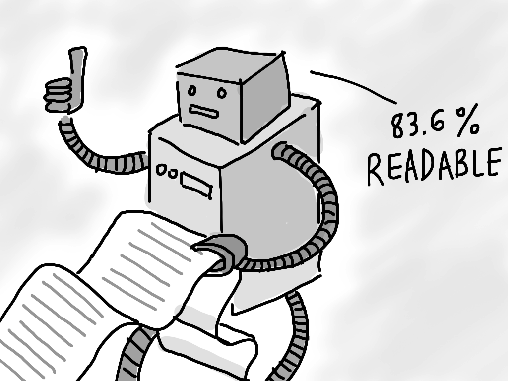

# On the changing notion of code readability
*Author: Kasper B. Graversen*
<br>[[Introduction]](http://kbilsted.github.io/CodeQualityAndReadability/) [[All categories]](http://kbilsted.github.io/CodeQualityAndReadability/AllTags.html) [[All articles]](http://kbilsted.github.io/CodeQualityAndReadability/AllArticles.html)
<br>
<Categories Tags="Code_Readability">
</Categories>

*We investigate the divide of opinion regarding what constitutes readable code -
experience (or lack thereof) and understanding of code (and lack thereof). 
We show that there are multiple layers of complexity when it comes to issues of readability.* 


Please show your support by sharing and voting:
<SocialShareButtons>
</SocialShareButtons>





Table of Content

   * [1. Introduction](#introduction)
   * [2. The psychology of less experienced developers](#the-psychology-of-less-experienced-developers)
   * [3. Investigating "surface complexity"](#investigating-surface-complexity)
     * [3.1 The notion of readability changes with growing experience](#the-notion-of-readability-changes-with-growing-experience)
       * [Version A](#version-a)
       * [Version B](#version-b)
       * [Version C](#version-c)
       * [Version D](#version-d)
       * [Version E](#version-e)
       * [Version F](#version-f)
       * [Final version](#final-version)
       * [Conclusions](#conclusions)
     * [3.2 The veterans perspective](#the-veterans-perspective)
   * [4. Investigating "underlying complexity"](#investigating-underlying-complexity)
   * [4.1 The architectural simplification that never became](#the-architectural-simplification-that-never-became)
   * [5. Conclusions](#conclusions)
   * [6. Comments](#comments)
   
   
   
## 1. Introduction   

As made painfully evident by the show "X-factor", the less you know about a subject, the smarter you think you are on that subject. Likewise, discussions on program readability and best practices easily descents into a discussion on personal preferences and habits. Of particular difficulty is the problem that the notion of what is readable code changes with the experience you have with programming. Complexity comes in many forms. Inspired by KhyronVorrac comments on Reddit, perhaps it is helpful to differentiate between *surface complexity* and *underlying complexity* when discussing the readability of code. 

**Surface complexity:** The complexity you immediately see when reading code. It is hard to exactly pin point, but includes code formatting, language features, and certain form of documentation.


**Underlying complexity:** The complexity you face *after* you have penetrated, or overcome (possibly come to accept) the *surface complexities*. It is the complexities concerning implementation idioms such as design patterns and best practices. 

This is not a complete definition; but it will serve for my current purposes.

Often people focus a lot on the surface complexity. Possibly this is because it is the first obstacle when having to read. In similar vein to how wrong it feels when a scientific paper is typeset  using the [Comic sans font](http://cdncms.fonts.net/images/288c15a0ce30b89f/AComicSans.jpg). But most of the surface complexity can be eradicated with knowing the language you are reading, and by being forgiving towards e.g. a different indent size than what you are used to. Or the fact that method names are always in lower case (Java) or Upper case (C#).

In this article we will look into how a beginners mindset changes with experience, and elaborate on the two kinds of complexities revolving readability issues.


## 2. The psychology of less experienced developers

Programming is a craft just as carpentry or alchemy. It requires a mixture of precision and good ideas. As with any craft, programming needs be taught as a combination of theory and field work. Inexperienced programmers have a tendency to use a programming style that is not well suited for larger software projects, and, at times, make the more experienced programmers spend wasteful time going through the code. 

Not surprisingly, this is part of learning any craft and if I were to do all the plumbing helping out a plumber, I'm sure he would tear his hair out in frustration over my approach.

*Unfortunately, inexperienced programmers easily fail to understand good code when they face it*. A novice or otherwise incompetent programmer, will look at perfectly good code and cry out in animated vociferation "This code is impenetrable! Who wrote this sh!!t".

**You can not throw good code at them and expect it to rub of.**

Recently, I overheard a conversation between technical inept people on the subject of code readability. I cringed so hard, my toe nails made bleeding wounds under my feet. I was wearing crutches for a week. Mentally, I was scarred for life.

They discussed a technical presentation where a piece of code, best described as "old legacy code", was undergoing a series of refactorings: A long method was made more readable and testable by separating it into several methods and classes. But to these people, it was utter hell. Even years after the presentation, they laugh in bemusement, ridiculing how the guy presenting "progress" was in fact, to them, making the code harder to understand. To them the initial code was like an open book; a continuous stream of code, that could be read in sequence. The refactored version, on the other hand, was a mess of isolated islands, sprinkled with method calls disrupting the flow of reading, requiring to "jump to definition" to continue on.

With university degrees in mathematics and economics, these people are not dumb. They're just not skilled programmers. That being said, if you have a small program (say below 1000 lines) it may be so small, that you are finding no difference in readability between a bite-sized separated version and one written as one long method. From a testability perspective, however, having to test the 1000 line method I am sure, will prove challenging.


## 3. Investigating "surface complexity"

Just to repeat. With **surface complexity** we mean the complexity you immediately see when reading code. It is hard to exactly pin point, but includes code formatting, language features, and certain form of documentation.

### 3.1 The notion of readability changes with growing experience

As previously stated, programming is a craft and mastery of which, is achieved through reading and writing programs. In my teaching career both at university teaching programming courses, and in industry, again and again I've made the same observation: When students' experience grow, their notion of readability changes. *Through a series of examples, we show how the transition in thinking shifts when programmers become more and more experienced*.

Given some field `txtName` on a Gui we have to figure out if anything has been entered. Having learned to extract into separate methods, lines that relate to the same thing, the less experienced programmer may develop "version A" to perform said check.

**Here we look at surface complexity**

#### Version A
```java
bool CheckName()
{
    string text;
    bool returnValue;

    text = txtName.getText();

    if (text.equals("") == true) 
    {
        returnValue = true;
    }
    else 
    {
        returnValue = false;
    }
    return returnValue;
}
```

With a bit of experience you can tell that this code is *too verbose*. It actually hurt readability as the intent of the code is blurred by the trivial assignments. The fact that it has been extracted out, though makes it bearable. This is with the caveat that if all code is as verbose as this, no amount of "extract method" can save you. Finally, you would probably register `CheckName()` as really undescriptive. More on this later.


#### Version B
Students are quick to realize that we don't need the variable `text`, and they learn we never write `== true`

```java
bool CheckName()
{
    bool returnValue;
    returnValue = txtName.getText().equals("");
    if (returnValue) 
    {
        return true;
    }
    else 
    {
        return false;
    }
}
```

A much shorter version, the `returnValue` variable is still a thorn in the eye and is reminiscent of the single-entry-single-return structure.


#### Version C

```java
bool CheckName()
{
    if (txtName.getText().equals("")) 
    {
        return true;
    }
    else 
    {
        return false;
    }
}
```

Now we are getting somewhere. The intent of the code is prevailing.


#### Version D

Now is the time to start dusting off the final trivialities. We don't need `else` since `return false` can only be reached if `return true` hasn't been executed.

```java
bool CheckName() 
{
    if (txtName.getText().equals("")) 
    {
        return true;
    }
    return false;
}
```

#### Version E
An alternative implementation can be achieved using the ternary operator.

```java
bool CheckName() 
{
    return (txtName.getText().equals("") ? true : false);
}
```


#### Version F
We now realize that, when the expression is true we return true, otherwise false. We can thus in-line this directly in by simply returning the result of the expression.


```java
bool CheckName() 
{
    return txtName.getText() == "";
}
```


#### Final version
At this stage, we must ponder whether we need this code to reside inside a methods at all. There are good arguments for concealing code, even tiny chunks of code inside a method, but alternatively we can just use the code as:

```java
if (txtName.getText() == "")
    ... 
```

It is hard define *when*, a method containing one line of code is good practice. Often I do it when the line I am extracting is not readily understandable, or maybe it is a central business requirement. When I feel the need to document a line of code in a method, I consider if I instead should extract it into a method and have the method name serve as documentation. Assume a business requirement that all SKU (Stock keeping unit number) is to start with `1`. Rather than in-line checking this in the code, I could be tempted to extracting this into a `IsValidSKU()` method. It is a much more compelling thought, than using the the totally generic `CheckName()` naming. 


#### Conclusions

Up until version E of the code, we find typical beginners code. *Beginners do not write verbose code out of malice. They do it to help themselves. To make the code readable to them.*

Sure the seasoned programmer can read the code in the version A form. But as shown, it is utterly verbose and would end up choking the overall readability of any larger code base.


### 3.2 The veterans perspective
Certainly, it is not easy to be a novice programmer. There are so much to learn. object-oriented programming, parameter propagation, IOC, error handling, databases, layered architecture, unit testing. I could go on. I sometimes lose my breath thinking about it. 

But as a veteran coder, life is not always easy either. **Sometimes you just look at code and immediately hate it.** There are many factors in making code unbearable. Here is a short list that popped into my mind as I typed away. The list is by no means closed. With enough time we could write a 100-page list I am sure. Feel free to edit and extend. 

- [ ] Verbose ornamented code 
- [ ] Over commenting the obvious, leaving the relevant stuff undocumented
- [ ] Absence of obvious language features (e.g. `catch` or `finally`)
- [ ] Misuse of language features such as `ref` or inheritance 
- [ ] Inconsistent formatting of code
- [ ] Long methods, doing too many things
- [ ] Untested or untestable code
- [ ] Bad naming of variables, or worse, reuse of badly named variables
- [ ] Leaving TODO's in the code when you say you are done
- [ ] Printing to the console (both business- and test-code)
- [ ] Erroneous error handling
- [ ] Moderate to heavy code duplication

Looking at this list in retrospective, it is clear that it revolves around *surface complexities*.

The other day I was visiting a cemetery for code. http://codebituary.com/  which is a resting place for start-up code that never made it. Through there, I clicked a random project which led to Github, and from there I clicked the first file name I found to be interesting. Take my check list and see how well I would score the below code.


```java
//offline crawl
public static void crawl(){
    //0) download main page
    String html;
    try {
        html = URLConnectionReader.getSecureText("https://www......");
    } catch (Exception e){
        e.printStackTrace();
        return;
    }
    //1) define categories
    int num_categories = 0;
    String[] categories = new String[1000];
    int i = html.indexOf("itemMenuName level2");
    while(i>0){
        html = html.substring(i+19,html.length());
        //find category urls
        i = html.indexOf("href=\"");
        html = html.substring(i+6,html.length());
        categories[num_categories] = html.substring(0,html.indexOf("\""));
        System.out.println(categories[num_categories]);
        //find next category
        num_categories++;
        i = html.indexOf("itemMenuName level2");;
    }
    //write to file
    PrintWriter pw = null;
    try {
        pw = new PrintWriter(new File("Bestbuy_products.txt"));
    } catch(Exception e){
        e.printStackTrace();
    }
    //2) for each category page
    for(i=0; i<num_categories; i++){
        try {
            //download page
            html = URLConnectionReader.getSecureText(categories[i]);
            //process
            Product[] temp = process(html);
            //detect num of pages
            //TODO
            //write to file
            for(Product product : temp){
                pw.print(product.name);
                pw.print("@@@@");
                pw.print(product.store);
                pw.print("@@@@");
                pw.print(product.price);
                pw.print("@@@@");
                pw.print(product.productlink);
                pw.println("");
                pw.flush();
            }
        } catch(Exception e){
            e.printStackTrace();
            pw.close();
            return;
        }
    }
    //close file
    pw.close();
}
```

Clearly there is a problem between my understanding of readable code and the above snippet. My intentions with posting this code, is of course not to hang the authors to dry. I find it more relevant to delve into real-life code, than making up examples on my own. But I'm digressing here. The point is that judging the code against my list, there are people out there that are programming in a vastly different manner than I! And eventually this creates tension if such different coding styles are to co-exist in the same project. Presumably both of us think that *our* code is "readable".

Assume that I and those authors were on the same project. Should it be I or them that should define the conduct of the company/project? I don't know the authors of the above code. Possibly the authors were in a hurry, or maybe this is how they prefer their code. Just to make sure, I went back and checked another file on the project. It was almost an exact copy of the above. Clearly code duplication was not an issue to them.


## 4. Investigating "underlying complexity"

As previously stated. **underlying complexity** means the complexity you face *after* you have penetrated, or, come to accept the *surface complexities*. It is the complexities concerning implementation idioms such as design patterns and best practices. 

For example, it is damn hard to grasp a given piece of code utilizing "template methods", "strategy", "composite", "decorators" or "bridge" when you are unaware of such said patterns.

As shown in [Malleable code by using decorators](https://github.com/kbilsted/CodeQualityAndReadability/blob/master/Articles/Design/MalleableCodeUsingDecorators.md) programming with decorators is a very different style than not using them. Both in terms of readability where the implementation tends to get more spread out. But also more fundamentally, how features are to be made up when future extensions are made.

Another programming idiom foreign to the less experienced programmer is that of separation of concerns, and the SOLID principles. If you blindly follow Uncle Bob, a method may be no longer than 10 lines of code, preferably less. Eg. the [Extract till you drop](https://sites.google.com/site/unclebobconsultingllc/one-thing-extract-till-you-drop)

So readability is not only reading the code line by line, but also, understanding the implementation strategies and architecture.

Part of being a professional programmer, is to know his trade. There are many design patterns around, but chances are, that the application you are working on is only using a handful. Spend time asking colleagues and reading up on the patterns and abstractions you do not know.


## 4.1 The architectural simplification that never became

Once in a multi-layered EJB application, I found a layer that was complete boiler code. For every entity in the system, a glue class had to be constructed in this layer. Anyone familiar with layered architecture knows how too many layers can lead to frustrations. This is not to say that I hate layered architecture. In fact I would not hesitate to recommending using it. At time though, you feel very unproductive when you want to add some functionality and find yourself spending a full afternoon implementing glue-boiler plate code in numerous layers. Then making a simple change, and having to go over one layer after another performing the same trivial changes - e.g. adding a parameter to a method. 

*So simplifying away a layer means making the whole team more productive, and less chances of making simple mistakes that may  precious time to debug and locate.*

Quickly through the use of reflection, I replaced all the implementations of the layer with *one* class. A whole layer was eradicated. Every one were happy. Or so I thought. At that particular shop, there was a very high density of less experienced programmers. They had domain knowledge, sure. But they did not know the reflection capabilities of the language they were using.  With little incentive to learn and grow, instead they were red alert. And so the reflection-implementation had to die. The argument was, that if the least experienced programmer had to fix a bug, was having difficulties reading and understanding what was going on, the bug might not get fixed. Notice how this wrongly became a discussion on whether some code was readable/understandable. When clearly it was a matter of certain team members not knowing (and not wanting to know) the full spectre of features of the programming language.

So is this a clear cut case of underlying complexity. Yes. Is it a case of surface complexity too? Indeed. Here we have a people having readability problems due to lack of understanding the programming language the software is developed in. The use of said features led to an implementation patter that likewise caused readability problems. 

And it reminds me of a quote

> "Never underestimate the power of stupid people in large groups."  
> - George Carlin


I can understand that people never having been exposed to reflection need to look twice or possibly trice at the code. Code using reflection *is* different. Very different in the fact that it is a solution that involves a number of types rather than operating on a specific type. Rather than invoking a method with `.` it may require searching for methods and dynamically bind arguments to said call. But this is difficult in the same sense that domain applications are difficult to grasp at first when you don't know the domain or the *ubiquitous language* used in modelling the domain. Heck, it is difficult the same way that you for the first time get exposed to the concepts of `ref`, `finally`-blocks or lambda's! And surely we wouldn't want those to get squeezed out of the code-base simply because some less experienced team member thinks its "unreadable". 


## 5. Conclusions

Novice and veterans prefer code in different forms. The inexperienced programmer have so many things in his head, remembering the syntax of the language, understanding coding constructs etc. that he is satisfied delivering when it works. He also prefer comments explaining the code in human language. 

But as the inexperienced gain more experience he changes his preferences. Suddenly, things needs be broken down, suddenly certain comments are superfluous - in the way - of the code to be read.Rather than reading a 1000-lines long method like a book, he wants the code split into many distinct entities to quickly get an overview of what the software does and digs into the entities, if needed.

Be wary when some one claims that a piece of code is impenetrable. Probe a bit. 

* Is it an issue with surface complexity or with underlying complexity? Code readability is hard to quantify and is inherently highly subjective. 
* Is the programmer experienced? 
* Does he know the business domain of the code? 
* Does he know the semantics of that part of the programming language or API that was used? 
* If all of those check out right, maybe you are the one doing things the wrong way :-)

Be cautious when requiring dumbing down the code base. It may seem to be resulting in more readable, but in fact may carry with it tons of code duplication and cruft. Things that are instinctively avoided by more experienced programmers. Rather than digress, one should embrace and seize the opportunity to grow and learn. Computer science is very much different to most other fields of profession. It is constantly moving and evolving. Every second year you'll find a major language releases or 3rd party API releases. You cannot fight this. Either you go with the flow, our you are quickly turning your application into a fossil site.


<SocialShareButtons>
</SocialShareButtons>


## 6. Comments
<CommentText>
</CommentText>
